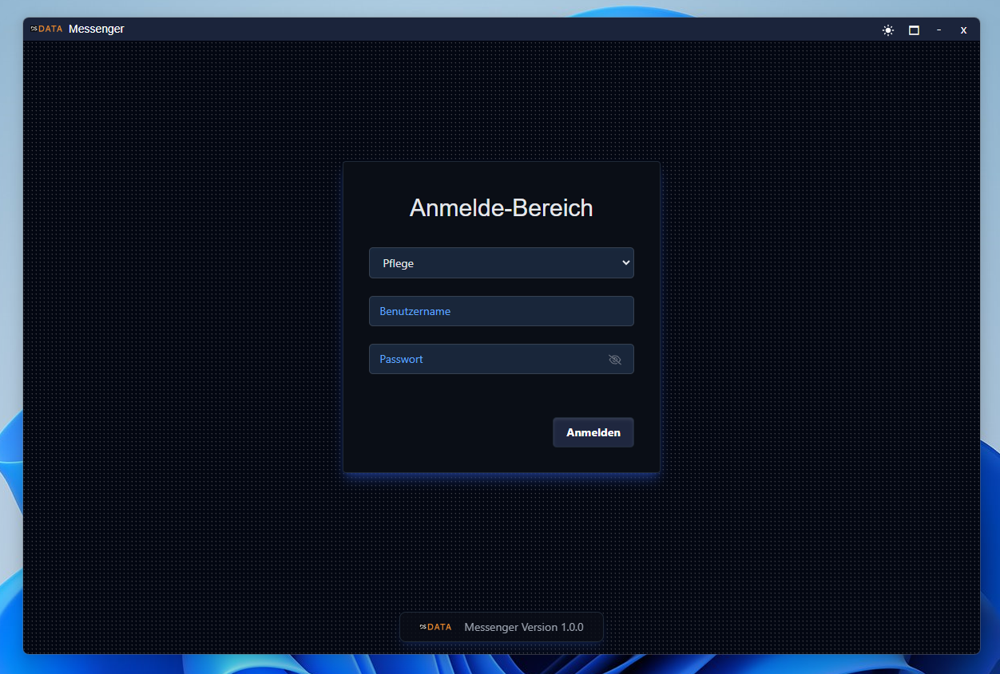
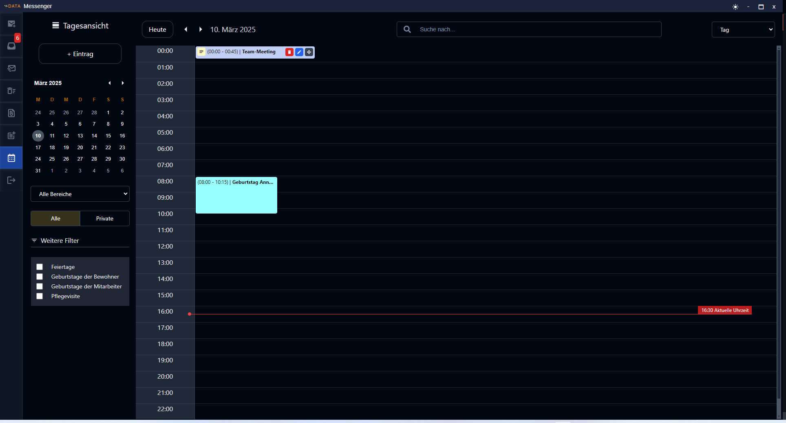
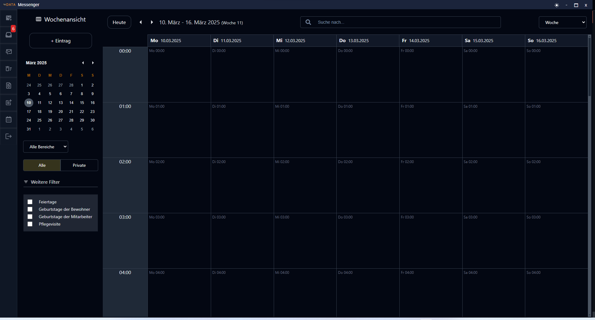
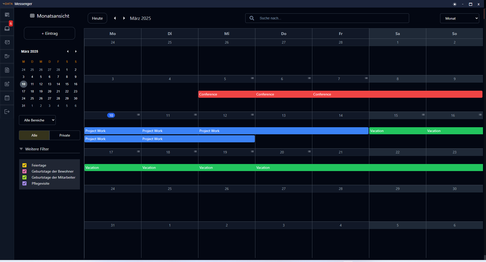
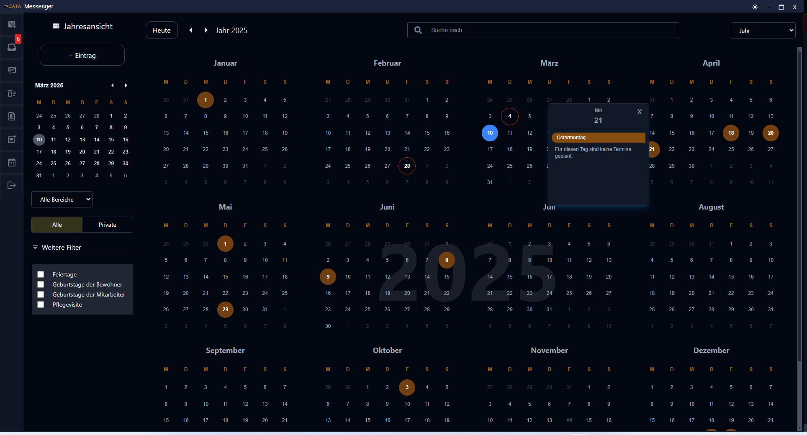

# REACT ELECTRON MEDICARE MESSENGER APPLICATION

## Description

The MEDICARE software is a comprehensive solution for residential care facilities, developed by DATA Schafhausen GmbH. It offers specialized modules for administration, care documentation, and staff scheduling. The goal is to reduce administrative and documentation workloads while streamlining care processes.

This React-Electron application is designed to replace the current messenger of the Medicare application in the future and facilitate the migration of Medicare to a cloud-based version over the course of the year.

Thanks to the ICP handler, the messenger can be launched either as a standalone application or within the existing Medicare app.

In addition to the previous version, a file explorer has been integrated, allowing users to search for files independently without having to browse through each message manually.

Due to its cross-platform compatibility, the application is automatically available for Windows, macOS, and Linux.

### Screens

| LOGIN                                            | INBOX                                             |
| ------------------------------------------------ | ------------------------------------------------- |
|  |   |
| FILE EXPLORER                                    | NEW MESSAGE                                       |
|  |   |
| LIGHT MODE                                       | INBOX LIGHT MODE                                  |
|  |   |
| CALENDAR DAILY                                   | CALENDAR WEEKLY                                   |
|  |   |
| CALENDAR MONTHLY                                 | CALENDAR YEARLY                                   |
|  |  |

### Build

```bash
# For windows
$ npm run build:win

# For macOS
$ npm run build:mac

# For Linux
$ npm run build:linux
```

### NSIS Installer-Script

```nsis
!define XAMPP_INSTALLER "xampp-windows-x64-8.2.4-0-VS16-installer.exe"
!define XAMPP_PATH "C:\xampp"
!define PHP_INI_PATH "C:\xampp\php\php.ini"
!define APACHE_CONFIG_PATH "C:\xampp\apache\conf\httpd.conf"
!define ODBC_DRIVER "msodbcsql.msi"
!define EXE_TO_RUN "$EXEDIR\YourProgram.exe"  ; Program located in the same directory as the installer

Outfile "XAMPP_Installer.exe"
RequestExecutionLevel admin
SilentInstall silent

Section "Install XAMPP"

    ; Install XAMPP silently
    ExecWait '"$EXEDIR\${XAMPP_INSTALLER}" --mode unattended'

    ; Wait for installation
    Sleep 5000

    ; Copy SQL Server driver DLLs to XAMPP PHP ext directory
    CopyFiles "$EXEDIR\php_pdo_sqlsrv_82_ts_64x.dll" "$XAMPP_PATH\php\ext\"
    CopyFiles "$EXEDIR\php_sqlsrv_82_ts_64x.dll" "$XAMPP_PATH\php\ext\"

    ; Modify php.ini to enable MSSQL ODBC extensions
    FileOpen $0 "${PHP_INI_PATH}" "a"
    FileWrite $0 "$\r$\n[SQLSRV]$\r$\nextension=php_pdo_sqlsrv_82_ts_64x.dll$\r$\nextension=php_sqlsrv_82_ts_64x.dll$\r$\n"
    FileClose $0

    ; Start Apache and MySQL
    ExecWait '"$XAMPP_PATH\xampp_start.exe"'

SectionEnd

Section "Install ODBC Driver"
    ExecWait '"$EXEDIR\${ODBC_DRIVER}" /quiet /norestart'
SectionEnd

Section "Run Application"
    ExecWait '"${EXE_TO_RUN}"'
SectionEnd

```
